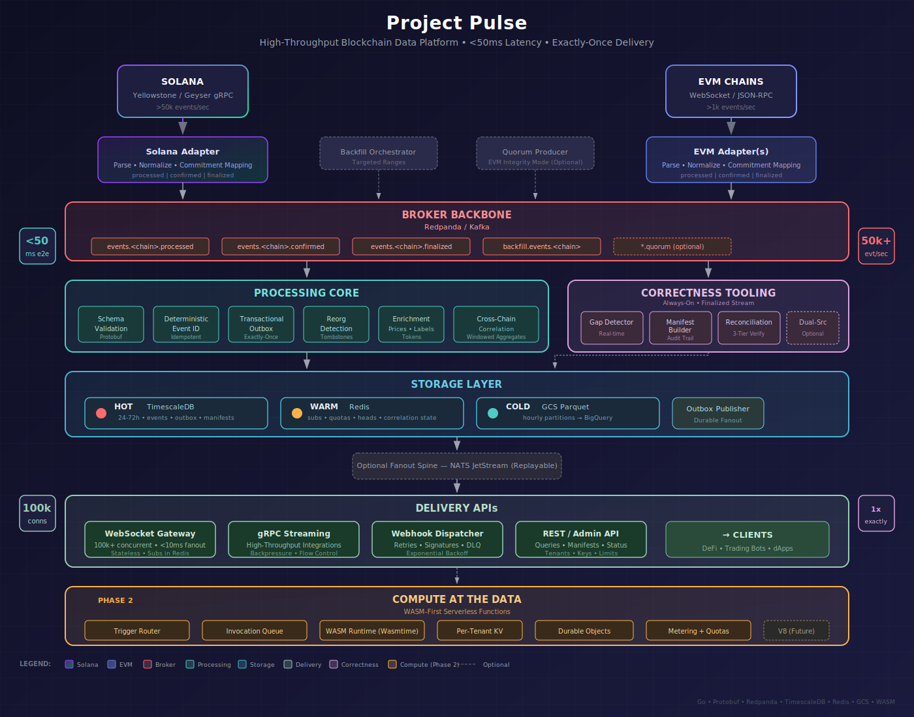

# Project Pulse

Project Pulse is a high-throughput, ultra-low-latency blockchain data platform designed to ingest, normalize, and deliver real-time events from Solana and EVM chains.

Unlike general-purpose indexers, Project Pulse focuses on two non-negotiable goals: **sub-50ms end-to-end latency** and **provable data correctness** (exactly-once delivery within commitment levels).

## Architecture Diagram

## Architectural Philosophy

The system design allows us to make "no-regret" moves for a future where users run compute directly next to the data. The architecture is driven by three core tenets:

1.  **Latency is the Product:** Every hop matters. We chose a hybrid architecture that allows fast paths for real-time data ("processed" blocks) while maintaining a parallel, rigorous path for "finalized" data.
2.  **Fail-Closed Correctness:** In the world of financial data, missing an event is worse than halting. Project Pulse is designed to stop the "finalized" watermark if data integrity cannot be mathematically proven via manifests.
3.  **Compute Proximity:** Data movement is the bottleneck. In Phase 2, Project Pulse enables users to deploy WASM functions that execute _inside_ the platform, eliminating the network latency of webhooks.

---

## Key Design Decisions & Tooling Choices

### 1. The Core Runtime: Go

**Decision:** We chose Go for the core adapters, processor, and delivery APIs.
**Why:**

- **Concurrency:** Goroutines are ideal for handling thousands of concurrent WebSocket connections and high-throughput event channels.
- **Latency:** Go's garbage collector is optimized for low pause times, which is critical for our p99 latency targets.
- **Ecosystem:** Excellent library support for both Solana (gRPC) and EVM (JSON-RPC/RLP) protocols.

### 2. The Nervous System: Redpanda (vs. Kafka)

**Decision:** We use Redpanda as the backbone for event streaming.
**Why:**

- **Performance:** Written in C++ using a thread-per-core architecture, Redpanda delivers significantly lower tail latency than JVM-based Kafka.
- **Operational Simplicity:** It ships as a single binary with no ZooKeeper dependency, simplifying our "local-first" development and deployment strategy.
- **Durability:** Strict `fsync` guarantees are essential for our "exactly-once" transactional outbox pattern.

### 3. The "Hybrid" Storage Model

**Decision:** We split storage into Hot (TimescaleDB) and Cold (GCS/BigQuery), avoiding a "one size fits all" database.
**Why:**

- **TimescaleDB (Hot):** Recent data (24-72h) needs to be queryable via SQL for UI/API lookups. Timescale handles high-velocity inserts better than standard Postgres while keeping the familiar SQL interface.
- **Parquet + BigQuery (Cold):** Blockchain history is immutable and massive. Storing years of history in Postgres is expensive and slow. Parquet files on object storage provide a cost-effective, scalable data lake for analytics.

### 4. The Fanout Spine: NATS JetStream

**Decision:** We use NATS JetStream specifically for the WebSocket delivery layer, separate from the main data pipeline.
**Why:**

- **Decoupling:** We don't want 100k+ WebSocket consumers slowing down the core ingestion pipeline.
- **Efficiency:** NATS is exceptionally lightweight and performant for "fan-out" patterns (one message -> thousands of subscribers), which is the primary pattern for live price updates and block events.

### 5. Compute Sandbox: WASM (WebAssembly)

**Decision:** Phase 2 uses a WASM runtime (Wasmtime) rather than Docker containers or JS isolates for user code.
**Why:**

- **Security:** WASM provides a strict, capability-based sandbox by default.
- **Startup Speed:** WASM modules instantiate in microseconds, whereas containers take seconds. This enables "scale-to-zero" efficiency.
- **Performance:** Near-native execution speed is required to run user logic on the hot path without introducing lag.

---

## System Components

- **Adapters (Solana/EVM):** Protocol-specific services that ingest raw data and normalize it into a canonical Protobuf format.
- **Processing Core:** Handles deduplication (deterministic IDs), reorg detection, and writes to the hot store.
- **Outbox Publisher:** Reads committed events from the database and publishes them to the delivery layer, ensuring atomicity.
- **Delivery Gateway:** Stateless WebSocket/gRPC servers that handle client connections and subscription filtering.

## First Proposed Steps

This is the implementation plan for **Milestone 1: Ingestion & Canonical Stream MVP**. Each phase builds on the previous one.

### Phase 1: Repository & Environment Setup

- [ ] **Initialize Project Repository**
  - [ ] Run `go mod init <module_name>` to initialize the Go module
  - [ ] Create standard directory structure (`cmd/`, `internal/`, `pkg/`, `deployments/`, `api/proto/`)
  - [ ] Create a `Makefile` with standard commands (`build`, `test`, `lint`, `proto`)
- [ ] **Docker Compose Environment**
  - [ ] Create `docker-compose.yml` defining services for Redpanda, Postgres (TimescaleDB), and Redis
  - [ ] Verify all services spin up and are accessible

### Phase 2: Canonical Schema Definition

- [ ] **Define Protobuf Schema**
  - [ ] Create `api/proto/v1/event.proto`
  - [ ] Define `CanonicalEvent` message with fields: `chain`, `commitment`, `block_number`, `block_hash`, `tx_hash`, `event_type`, `payload`, `timestamp`
  - [ ] Configure `buf` or `protoc` generation in `Makefile`
  - [ ] Generate Go code from the proto definition

### Phase 3: Adapter Implementation (Solana)

- [ ] **Solana Adapter Scaffold**
  - [ ] Create `cmd/adapter-solana/` and `internal/adapter/solana/`
  - [ ] Implement main entrypoint that loads configuration (env vars)
- [ ] **Connect to Geyser gRPC**
  - [ ] Implement a gRPC client to connect to a Solana Yellowstone Geyser endpoint
  - [ ] Implement a subscription mechanism to receive block/transaction updates
  - [ ] Log received events to stdout for verification

### Phase 4: Adapter Implementation (EVM)

- [ ] **EVM Adapter Scaffold**
  - [ ] Create `cmd/adapter-evm/` and `internal/adapter/evm/`
  - [ ] Implement main entrypoint that loads configuration
- [ ] **Connect to EVM RPC**
  - [ ] Implement a standard `ethclient` or WebSocket connection to an EVM chain
  - [ ] Implement log subscription (`eth_subscribe` "logs")
  - [ ] Log received logs to stdout for verification

### Phase 5: Core Processing & Normalization

- [ ] **Processor Scaffold**
  - [ ] Create `cmd/processor/` and `internal/processor/`
- [ ] **Normalization Logic**
  - [ ] Implement a `Normalizer` interface
  - [ ] Implement specific normalization logic for Solana events → `CanonicalEvent`
  - [ ] Implement specific normalization logic for EVM logs → `CanonicalEvent`
  - [ ] Write unit tests to verify mapping of fields
