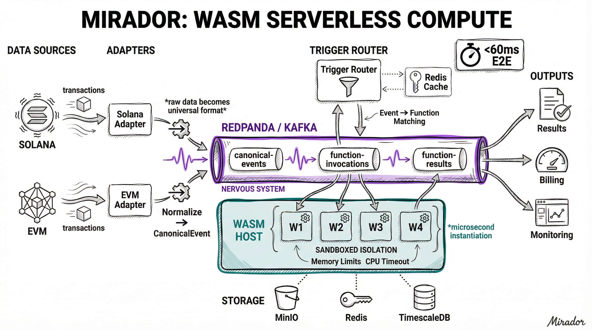

# Pulse (Project Pulse)

Pulse is a high-throughput, ultra-low-latency blockchain data platform designed to ingest, normalize, and deliver real-time events from Solana and EVM chains. It enables users to deploy WASM functions that execute directly on the event stream.

Unlike general-purpose indexers, Pulse focuses on two non-negotiable goals: **sub-50ms end-to-end latency** and **provable data correctness** (exactly-once delivery within commitment levels).

---

## Quick Start

### Prerequisites

- **Go 1.21+** - For building services and WASM modules
- **Docker & Docker Compose** - For running the local infrastructure stack
- **Make** - For build automation

### 1. Start the Platform

```bash
# Clone and enter the repository
git clone <repository-url>
cd pulse

# Start all infrastructure services (Redpanda, TimescaleDB, Redis, MinIO, etc.)
make up

# Wait for all services to be healthy (~30 seconds)
docker compose -f deployments/docker/docker-compose.yml ps
```

### 2. Build the CLI

```bash
go build -o bin/pulse ./cmd/pulse
```

### 3. Build and Deploy a WASM Function

```bash
# Build the example WASM module (uses standard Go with WASI target)
cd examples/hello-world
GOOS=wasip1 GOARCH=wasm go build -o hello.wasm .
cd ../..

# Deploy to the platform
./bin/pulse deploy examples/hello-world/hello.wasm --name hello-world
# Note the function ID returned (e.g., fn_1234567890)
```

### 4. Create a Trigger

```bash
# Create a trigger to invoke the function on Solana transactions
./bin/pulse triggers create \
  --function-id <function-id> \
  --name solana-watcher \
  --event-type transaction \
  --filter-chain 1
```

### 5. Verify It Works

```bash
# Watch the WASM host logs for execution output
docker compose -f deployments/docker/docker-compose.yml logs -f wasm-host 2>&1 | grep "source.*wasm"
```

You should see log output from your WASM function processing real Solana devnet transactions.

For detailed verification steps, see [LOCAL_TEST.md](LOCAL_TEST.md).

---

## Architecture Diagram



## Architectural Philosophy

The system design allows us to make "no-regret" moves for a future where users run compute directly next to the data. The architecture is driven by three core tenets:

1.  **Latency is the Product:** Every hop matters. We chose a hybrid architecture that allows fast paths for real-time data ("processed" blocks) while maintaining a parallel, rigorous path for "finalized" data.
2.  **Fail-Closed Correctness:** In the world of financial data, missing an event is worse than halting. Project Pulse is designed to stop the "finalized" watermark if data integrity cannot be mathematically proven via manifests.
3.  **Compute Proximity:** Data movement is the bottleneck. In Phase 2, Project Pulse enables users to deploy WASM functions that execute _inside_ the platform, eliminating the network latency of webhooks.

---

## Key Design Decisions & Tooling Choices

### 1. The Core Runtime: Go

**Decision:** We chose Go for the core adapters, processor, and delivery APIs.
**Why:**

- **Concurrency:** Goroutines are ideal for handling thousands of concurrent WebSocket connections and high-throughput event channels.
- **Latency:** Go's garbage collector is optimized for low pause times, which is critical for our p99 latency targets.
- **Ecosystem:** Excellent library support for both Solana (gRPC) and EVM (JSON-RPC/RLP) protocols.

### 2. The Nervous System: Redpanda (vs. Kafka)

**Decision:** We use Redpanda as the backbone for event streaming.
**Why:**

- **Performance:** Written in C++ using a thread-per-core architecture, Redpanda delivers significantly lower tail latency than JVM-based Kafka.
- **Operational Simplicity:** It ships as a single binary with no ZooKeeper dependency, simplifying our "local-first" development and deployment strategy.
- **Durability:** Strict `fsync` guarantees are essential for our "exactly-once" transactional outbox pattern.

### 3. The "Hybrid" Storage Model

**Decision:** We split storage into Hot (TimescaleDB) and Cold (GCS/BigQuery), avoiding a "one size fits all" database.
**Why:**

- **TimescaleDB (Hot):** Recent data (24-72h) needs to be queryable via SQL for UI/API lookups. Timescale handles high-velocity inserts better than standard Postgres while keeping the familiar SQL interface.
- **Parquet + BigQuery (Cold):** Blockchain history is immutable and massive. Storing years of history in Postgres is expensive and slow. Parquet files on object storage provide a cost-effective, scalable data lake for analytics.

### 4. The Fanout Spine: NATS JetStream

**Decision:** We use NATS JetStream specifically for the WebSocket delivery layer, separate from the main data pipeline.
**Why:**

- **Decoupling:** We don't want 100k+ WebSocket consumers slowing down the core ingestion pipeline.
- **Efficiency:** NATS is exceptionally lightweight and performant for "fan-out" patterns (one message -> thousands of subscribers), which is the primary pattern for live price updates and block events.

### 5. Compute Sandbox: WASM (WebAssembly)

**Decision:** Phase 2 uses a WASM runtime (Wasmtime) rather than Docker containers or JS isolates for user code.
**Why:**

- **Security:** WASM provides a strict, capability-based sandbox by default.
- **Startup Speed:** WASM modules instantiate in microseconds, whereas containers take seconds. This enables "scale-to-zero" efficiency.
- **Performance:** Near-native execution speed is required to run user logic on the hot path without introducing lag.

---

## System Components

The platform consists of the following services:

| Component | Description | Docker Service |
|-----------|-------------|----------------|
| **Solana Adapter** | Ingests Solana transactions via WebSocket (devnet) or Geyser gRPC (mainnet). Normalizes to canonical format. | `adapter-solana` |
| **EVM Adapter** | Ingests EVM chain logs via RPC. Normalizes to canonical format. | `adapter-evm` |
| **Processor** | Core event processing - deduplication, reorg detection, normalization. | `processor` |
| **Trigger Router** | Matches canonical events against registered triggers. Routes to WASM invocations. | `trigger-router` |
| **WASM Host** | Executes user-deployed WASM functions with wasmtime runtime. Sandboxed execution. | `wasm-host` |
| **Function API** | REST API for managing functions, triggers, and viewing invocation logs. | `function-api` |
| **API Gateway** | WebSocket/REST gateway for real-time event streaming to clients. | `api-gateway` |

### Data Flow

```
Blockchain → Adapter → Redpanda (canonical-events) → Trigger Router
                                                           ↓
                                    Redpanda (function-invocations)
                                                           ↓
                                                      WASM Host → Execute Function
                                                           ↓
                                    Redpanda (function-results) → Logs/Metrics
```

### Infrastructure Services

| Service | Purpose | Port |
|---------|---------|------|
| Redpanda | Kafka-compatible event streaming | 9092 |
| TimescaleDB | PostgreSQL with time-series optimization | 5432 |
| Redis | Caching, trigger lookups, function state | 16379 |
| MinIO | S3-compatible storage for WASM modules | 9000/9001 |
| NATS | Low-latency fanout for WebSocket delivery | 4222 |
| Prometheus | Metrics collection | 9090 |
| Grafana | Dashboards and visualization | 3000 |

---

## Pulse CLI

The `pulse` CLI tool allows you to deploy and manage WASM functions, configure triggers, and monitor invocations.

### Installation

```bash
# Build from source
go build -o pulse ./cmd/pulse
```

### Getting Started

#### 1. Deploy a WASM Function

```bash
# Deploy a function with automatic naming (uses filename)
pulse deploy myfunction.wasm

# Deploy with a custom name and version
pulse deploy transform.wasm --name my-transformer --version 1.0.0
```

#### 2. Configure a Trigger

Triggers define which blockchain events should invoke your function:

```bash
# Create a trigger for Transfer events
pulse triggers create \
  --function-id <function-id> \
  --name transfer-watcher \
  --event-type Transfer \
  --filter-chain 1 \
  --filter-addr 0xdAC17F958D2ee523a2206206994597C13D831ec7
```

#### 3. Monitor Invocations

```bash
# View recent invocation logs
pulse logs <function-id>

# View only failed invocations
pulse logs <function-id> --errors

# Limit results
pulse logs <function-id> --limit 10
```

### Development Workflow

Use dev mode for rapid iteration:

```bash
# Watch a file and auto-deploy on changes
pulse dev myfunction.wasm --name my-function

# Custom poll interval (seconds)
pulse dev myfunction.wasm --interval 5
```

### Command Reference

| Command | Description |
|---------|-------------|
| `pulse deploy <file>` | Deploy a WASM function |
| `pulse dev <file>` | Watch and auto-deploy on changes |
| `pulse functions list` | List deployed functions |
| `pulse functions get <id>` | Get function details |
| `pulse functions delete <id>` | Delete a function |
| `pulse triggers list` | List all triggers |
| `pulse triggers create` | Create a new trigger |
| `pulse triggers get <id>` | Get trigger details |
| `pulse triggers delete <id>` | Delete a trigger |
| `pulse logs <function-id>` | Show invocation logs |

### Environment Variables

| Variable | Default | Description |
|----------|---------|-------------|
| `PULSE_API_ENDPOINT` | `http://localhost:8090` | API gateway endpoint |
| `PULSE_TENANT_ID` | `default` | Tenant identifier |

### Example: Hello World Function

See the [examples/hello-world](examples/hello-world/) directory for a complete example of building and deploying a WASM function.

---

## Local vs Production Setup

### Local Development (Docker Compose)

The local development stack runs all services in Docker Compose with these characteristics:

- **Solana Adapter**: Connects to Solana Devnet via WebSocket (`wss://api.devnet.solana.com`)
- **Storage**: All data stored in Docker volumes (ephemeral by default)
- **Single-node**: All services run as single instances
- **Ports**: Services exposed on localhost for debugging

```bash
# Start all services
make up

# View logs
docker compose -f deployments/docker/docker-compose.yml logs -f

# Stop and clean up
make down
```

**Configuration via `.env`:**
```bash
# Optional: Override Solana endpoint
SOLANA_WS_ENDPOINT=wss://api.mainnet-beta.solana.com

# Optional: Use Geyser gRPC instead of WebSocket
SOLANA_ADAPTER_TYPE=grpc
GEYSER_ENDPOINT=http://your-geyser-endpoint:10000
GEYSER_TOKEN=your-token
```

### Production (Kubernetes/GKE)

Production deployment uses Kubernetes with:

- **Solana Adapter**: Connects to Yellowstone Geyser gRPC for lower latency
- **Managed Services**: Cloud SQL (TimescaleDB), Memorystore (Redis), Cloud Storage
- **Horizontal Scaling**: Multiple replicas per service with partition-based load distribution
- **Monitoring**: Prometheus + Grafana with alerting

See `deployments/k8s/` for Kubernetes manifests and `deployments/terraform/` for infrastructure provisioning.

### Key Differences

| Aspect | Local | Production |
|--------|-------|------------|
| Solana Source | WebSocket (devnet) | Geyser gRPC (mainnet) |
| Kafka | Redpanda (single node) | Redpanda cluster or Confluent |
| Database | TimescaleDB (Docker) | Cloud SQL with read replicas |
| WASM Storage | MinIO (local) | GCS bucket |
| Replicas | 1 per service | Auto-scaled |
| Data Retention | Ephemeral | Hot (72h) + Cold (Parquet) |

---

## Troubleshooting

### Events not triggering WASM execution

1. **Check adapter is receiving events:**
   ```bash
   docker compose -f deployments/docker/docker-compose.yml logs adapter-solana | tail -20
   ```

2. **Check trigger-router is matching:**
   ```bash
   docker compose -f deployments/docker/docker-compose.yml logs trigger-router | grep -i "match\|trigger"
   ```

3. **Check WASM host is executing:**
   ```bash
   docker compose -f deployments/docker/docker-compose.yml logs wasm-host | grep -i "execut\|invoke"
   ```

### WASM module not found

Ensure the module was uploaded to MinIO:
```bash
docker exec pulse-minio mc ls local/wasm-modules/
```

### Database connection issues

Verify TimescaleDB is healthy:
```bash
docker exec pulse-timescaledb pg_isready -U pulse
```

---

## Development

### Building Services

```bash
# Build all binaries
make build

# Build specific service
go build -o bin/adapter-solana ./cmd/adapter-solana

# Build WASM example
cd examples/hello-world && GOOS=wasip1 GOARCH=wasm go build -o hello.wasm .
```

### Running Tests

```bash
make test
```

### Useful Make Targets

| Target | Description |
|--------|-------------|
| `make up` | Start Docker Compose stack |
| `make down` | Stop and remove containers |
| `make build` | Build all Go binaries |
| `make test` | Run tests |
| `make lint` | Run linters |
